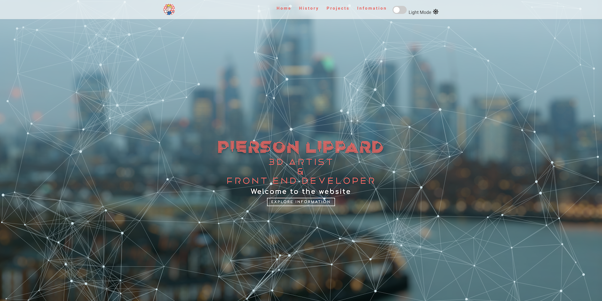

Founders & Coders - Application requirement:
Personal Website (for Pierson Lippard).

Requirement Features:

Responsive flexbox web design.

Light/Dark mode toggle, on the responsive navbar.

Image carousel, with clickable image links to some of my github projects.

Tab Panel, with some Information explaining my reasons for learning to code.

Links to requirment coding sites and my career social media accounts.

Other Features:

Included smooth scrolling functionallity.

Interactive wireframe background particles in header banner.

Career history section.
